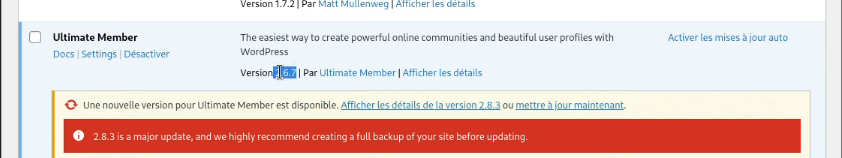

# Proof of concept CVE-2024-1071: WordPress Vulnerability Exploited

> **Disclaimer**: This Proof of Concept (POC) is made for educational and ethical testing purposes only. Usage of this tool for attacking targets without prior mutual consent is illegal. It is the end user’s responsibility to obey all applicable local, state, and federal laws. Developers assume no liability and are not responsible for any misuse or damage caused by this program.

## Getting Started
The Ultimate Member – User Profile, Registration, Login, Member Directory, Content Restriction & Membership Plugin plugin for WordPress is vulnerable to SQL Injection via the 'sorting' parameter in versions 2.1.3 to 2.8.2 due to insufficient escaping on the user supplied parameter and lack of sufficient preparation on the existing SQL query. This makes it possible for unauthenticated attackers to append additional SQL queries into already existing queries that can be used to extract sensitive information from the database.


### Finding Targets

To find potential targets, use Fofa (similar to Shodan.io):

- **FOFA Dork** : `body="/wp-content/plugins/ultimate-member"`
- **Hunter** : `Hunter: body="/wp-content/plugins/ultimate-member"`

### Cloning the Repository

First, clone the repository:

```bash
- git clone https://github.com/fa-rrel/CVE-2024-1071-SQL-Injection.git
- cd CVE-2024-1071-SQL-Injection
```

Next chose your target and add it to urls.txt file in this format:

- https://testphp.vulnweb.com/
- https://www.hackthissite.org/
- https://www.acunetix.com/

Run the Exploit:

```bash
python3 CVE-2024-1071.py -f urls.txt
```

# Reference POC
- https://nvd.nist.gov/vuln/detail/CVE-2024-1071
- https://github.com/gbrsh
- https://wpscan.com/vulnerability/dcca7ed0-b088-4b7d-9e22-07b858367975/
- https://www.broadcom.com/support/security-center/protection-bulletin/cve-2024-1071-wordpress-ultimate-member-plugin-vulnerability
- https://vuldb.com/?id.254667
